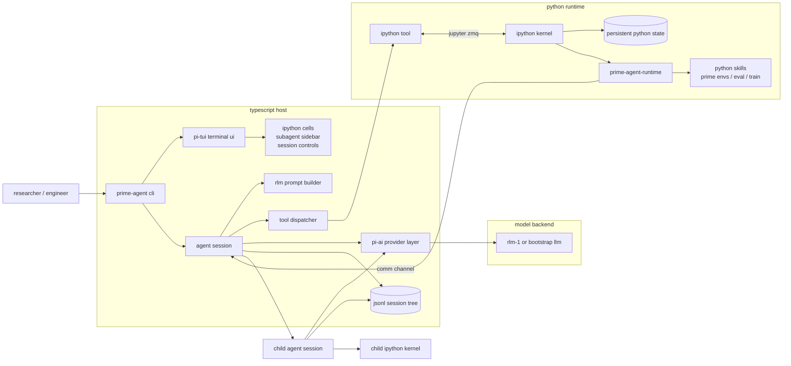

# Prime Agent

Prime Agent is a hard fork of [pi](https://github.com/badlogic/pi-mono) rebuilt around an RLM-native coding and research harness. The TypeScript host keeps pi's terminal UI, provider layer, sessions, and extension machinery, while the model-facing runtime is centered on a persistent IPython kernel and recursive subagents.

## Architecture

The key loop is:

1. The model receives a normal chat turn plus the RLM system prompt.
2. Tool use goes through the `ipython` tool, which executes code in a persistent IPython kernel.
3. Python variables, imports, loaded logs, dataframes, and helper functions survive across turns.
4. The injected `rlm` callable lets code spawn recursive child agents with `await rlm("subtask")` or fan out with `asyncio.gather(...)`.
5. Each child gets its own agent session and kernel, then returns an `RLMResult` to the parent kernel.
6. The TUI renders kernel cells and the live child-agent tree while preserving the session history on disk.

The default model-facing tool surface is intentionally small: `ipython` first, with RLM-shaped `bash` and `edit` support available where enabled. Prime platform capabilities are exposed as Python skills inside the kernel instead of as separate LLM tools.
