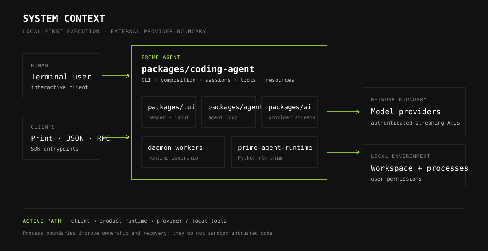
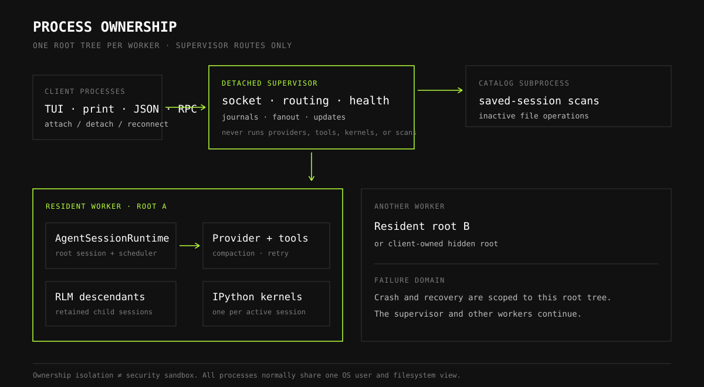
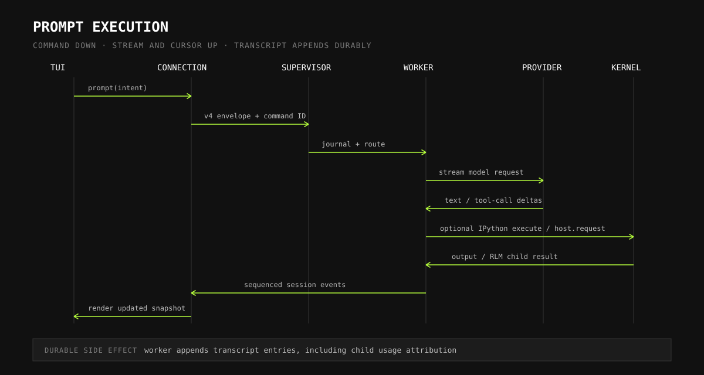
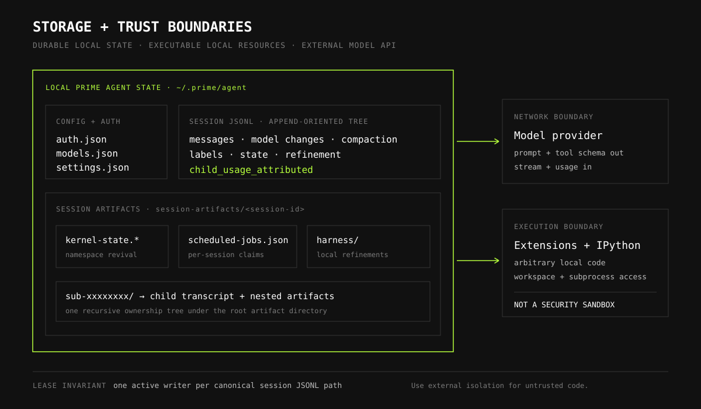

# Architecture

Prime Agent is a local-first coding agent built as a TypeScript monorepo with a small Python runtime for persistent IPython and recursive sub-agents. The terminal client is separated from execution by `AgentConnection`; normal sessions execute in daemon-owned workers, and each worker owns a complete root session tree.

This page is the stable overview. Detailed implementation documents are linked at the end.

## System Context



A user interacts through the terminal UI or a headless client. The coding-agent package composes the product: configuration, resources, sessions, daemon transport, tools, extensions, and the CLI. It builds on the shared agent loop, provider abstraction, and terminal renderer.

Model requests leave the local execution boundary only through configured provider APIs. IPython and extension code execute locally with the user's permissions unless Prime Agent itself is running inside an external sandbox.

## Package Responsibilities

| Path | Responsibility |
|---|---|
| `packages/ai` | Provider-neutral models, messages, streaming events, credentials hooks, and built-in provider registration. |
| `packages/agent` | The reusable agent loop, tool execution lifecycle, queues, state, and model-stream orchestration. |
| `packages/tui` | Terminal rendering, input, components, overlays, and differential screen updates. |
| `packages/coding-agent` | Prime Agent CLI, session runtime, daemon, persistence, IPython tool, RLM orchestration, extensions, skills, and product UI. |
| `prime-agent-runtime` | Python package installed into the managed kernel environment; exposes `rlm`, harness state, host requests, and Python-facing result types. |

The dependency direction is intentionally one-way: coding-agent composes the lower-level TypeScript packages. The Python runtime talks back to the owning `AgentSession` only through typed Jupyter comm requests.

## Runtime and Process Ownership



Normal interactive startup creates or reuses a detached supervisor and attaches through `DaemonAgentConnection`. The supervisor owns routing and coordination; it does not run model or tool work.

Each resident worker owns:

- one root `AgentSessionRuntime` and `AgentSession`;
- every recursive child below that root;
- persistent IPython kernels for those sessions;
- provider streams, tools, compaction, and retry state;
- the root scheduler and per-session job stores; and
- the lease for every persisted transcript it has open.

Closing the TUI detaches the client while the resident worker continues. Print, JSON, piped-stdin, and RPC clients use client-owned workers with bounded owner lifecycles. SDK entrypoints may still run in-process for source compatibility.

The catalog subprocess handles saved-session scans and inactive file operations, keeping history-sized work off the supervisor event loop.

Worker isolation limits the blast radius of a runtime crash, but it is not a security sandbox. Supervisor, workers, kernels, extensions, and tools normally run as the same OS user.

## Prompt Execution



The interactive prompt path is:

1. `InteractiveMode` calls `AgentConnection.prompt()`.
2. `DaemonAgentConnection` sends a versioned command envelope over the local JSONL socket.
3. The supervisor authenticates, journals, and routes the command to the owning worker.
4. `AgentSession` builds context and starts the shared agent loop.
5. `packages/ai` streams the configured provider response.
6. Tool calls execute in the worker. IPython calls enter the session's persistent kernel.
7. Session and agent events return through the worker transport and supervisor.
8. The connection applies cursor ordering and updates the TUI.
9. Transcript entries and child usage attributions append to session JSONL.

If Python calls `rlm(...)`, the kernel opens a `host.request` comm. The parent session creates another `AgentSession` through the same runtime stack. Multiple comms can run independent children concurrently, and daemon-backed children can remain addressable after their initial result returns.

## Connection and Recovery Model

The local public daemon protocol is JSONL-framed and currently at protocol v4. Commands carry protocol metadata, stable client identity, and command identity. Mutations are journaled before dispatch, making a completed retry idempotent and an uncertain result explicit.

Live events carry generation-aware cursors:

```text
{ generation, sequence }
```

The client reconnects with its last cursor. The daemon reports replay availability and always establishes a coherent attach snapshot. Large transcripts use begin/chunk/end streaming; the target chunk size is 512 KiB, and transcript caches become file-backed above 4 MiB.

A sequence number must never be compared across generations. When replay is incomplete or the generation changed, the fresh snapshot is authoritative.

## Sessions and Storage



Prime Agent's default local state root is `~/.prime/agent/`. Important durable data includes:

```text
~/.prime/agent/
  auth.json
  models.json
  settings.json
  sessions/
    <session-id>.jsonl
  session-artifacts/
    <session-id>/
      kernel-state.dill
      kernel-state.json
      scheduled-jobs.json
      harness/
        harness_state.json
      sub-xxxxxxxx/
        <child-session-id>.jsonl
  harness/
    harness_state.json
  logs/
```

Files appear only when the corresponding feature is used. The session directory can be overridden by configuration.

### Transcript model

Session JSONL is append-oriented. A header identifies the session and working directory; later entries form a parent-linked tree. Entries include messages, model and thinking changes, compactions, branch summaries, labels, session state, refinement records, and child usage attribution.

The current session format is version 3. A `child_usage_attributed` entry points to the parent assistant message, records the child's usage, and records the new aggregate. Reload reapplies the aggregate while context-tree views can still separate each agent's own usage.

### Artifacts

Large or feature-specific state stays out of the transcript:

- IPython namespace snapshots;
- per-session scheduled jobs;
- local continual-harness state and refinement history;
- RLM child transcripts and nested artifacts; and
- tool outputs or other registered artifacts.

Persisted session files are protected by canonical-path leases, so two workers cannot write the same transcript concurrently.

## Trust Boundaries

Prime Agent has process and transport boundaries, but they are not all security boundaries.

| Boundary | What it provides | What it does not provide |
|---|---|---|
| Client to supervisor socket | Local framing, protocol versioning, client identity, routing, reconnect. | Authorization between different users on the same account or remote network security. |
| Supervisor to worker | Per-worker authentication token, supervisor-generation fencing, process isolation. | OS-user or filesystem isolation. |
| Worker to provider | Provider authentication and network API boundary. | Protection from data intentionally included in prompts. |
| Worker to IPython | Jupyter framing, per-session lifecycle, interrupt and cleanup. | Sandboxing of model-generated Python or shell commands. |
| Resource loader to extensions/skills | Discovery, precedence, diagnostics, and configurable enablement. | Safety review of third-party code or instructions. |

Operational consequences:

- `auth.json` and worker descriptors contain sensitive local state and must remain owner-readable only.
- Extensions run arbitrary JavaScript with the worker's permissions.
- Skills can instruct the model to execute code and should be reviewed before enabling.
- IPython runs model-generated code in the session working directory.
- Use a VM, container, hosted sandbox, or restricted user account when processing untrusted repositories or instructions.

The model-facing Python runtime receives model metadata and typed host results, not the full credential store. Provider keys are resolved in the TypeScript host.

## Architectural Invariants

Changes should preserve these properties:

1. `InteractiveMode` depends on `AgentConnection`, not runtime, session-manager, or daemon internals.
2. The supervisor routes and coordinates; workers execute.
3. One worker owns one root tree and all of its recursive descendants.
4. A persisted transcript has one active writer lease.
5. Event ordering is scoped to a generation-aware cursor.
6. Missing replay recovers through a coherent snapshot.
7. RLM child execution uses the same TypeScript agent stack as root execution.
8. Child usage is attributable and persisted in the parent aggregate.
9. Callback-bearing extension behavior never crosses a generic transport boundary.
10. Process isolation must not be described as security sandboxing.

Daemon wire changes must be classified as backward-compatible, capability-gated, or incompatible. Update protocol/schema metadata and compatibility tests with every wire change.

## Detailed References

- [AgentConnection architecture](agent-connection-readme.md)
- [Daemon and session worker architecture](daemon-implementation-summary.md)
- [Kernel and RLM recursion](kernel-and-rlm-recursion.md)
- [Extensions](extensions.md)
- [Skills](skills.md)
- [Session format](session-format.md)
- [Provider setup](providers.md)
